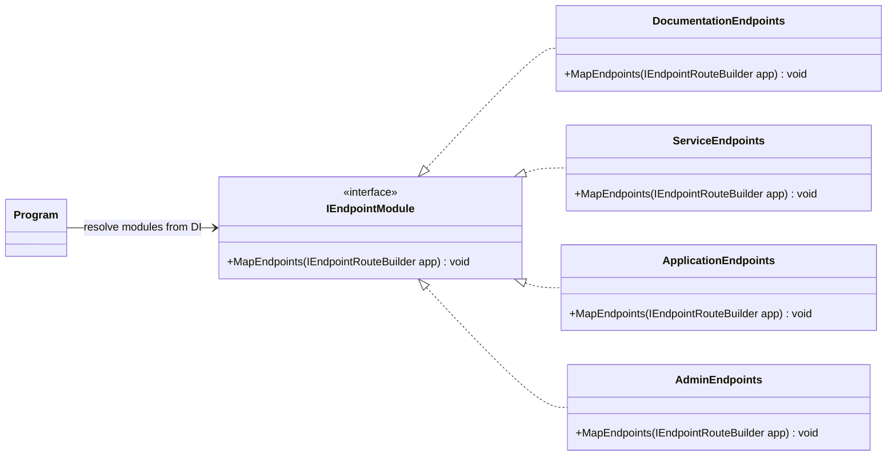

# Feature

Modularize QuestionnaireService minimal API endpoints for scalability and maintainability.

## Functional requirements

- Future endpoints can be added without modifying `Program.cs` directly.
- Split endpoints into documentation, service, application, and admin groups.
- Ensure each endpoint group resides in its own module to support independent evolution.
- No feature is added.

## Technical requirements

- Introduce an endpoint module abstraction that encapsulates route registration: an `IEndpointModule` interface with a `MapEndpoints` method.
- Create module implementations dedicated to documentation, service, application, and admin endpoints.
- Register all endpoint modules with the DI container and apply them during app startup.

## Test scenarios

### Regression testing

- All existing unit and integration tests must continue to pass.
